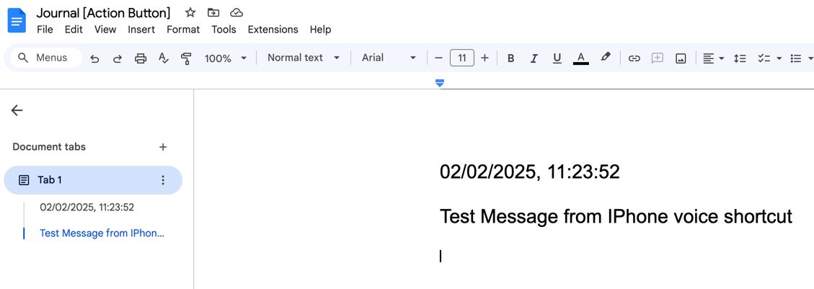

# speech-to-docs

A Node.js application that transcribes audio recordings into text and automatically saves them to Google Docs. Perfect for maintaining voice notes, meeting minutes, or any spoken content in a written format.



## Environment Variables

Create a `.env` file with the following variables:

```plaintext
OPENAI_SPEECH_API_KEY=
DOC_ID=The ID of the Google document where the text will be saved
TIMEZONE=your_timezone (example: Asia/Jerusalem)
PERSONAL_AUTH_TOKEN=Create your personal key to use when calling the API 

# Google Service Account Credentials
TYPE=
PROJECT_ID=
PRIVATE_KEY_ID=
PRIVATE_KEY=
CLIENT_EMAIL=
CLIENT_ID=
AUTH_URI=
TOKEN_URI=
AUTH_PROVIDER_X509_CERT_URL=
CLIENT_X509_CERT_URL=
```

## Features

- Audio file transcription using OpenAI's Whisper model
- Automatic saving of transcriptions to Google Docs
- Timestamp recording for each transcription
- Support for M4A audio format
- RESTful API interface

## Technical Stack

- Node.js with Express.js
- OpenAI API (Whisper model for transcription)
- Google Docs API
- Multer for file upload handling

## Prerequisites

- Node.js installed
- OpenAI API key
- Google Cloud project with enabled Google Docs API
- Google Service Account credentials

## How to test api with curl

```bash
curl -F "audio=@[path to file].m4a;type=audio/m4a" \
-H "Authorization:[your personal auth token]" \
-X POST https://[your api url]/transcribe
```
